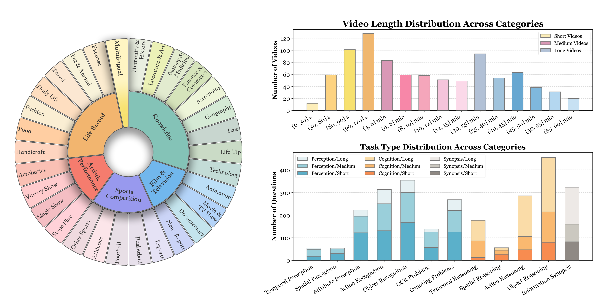
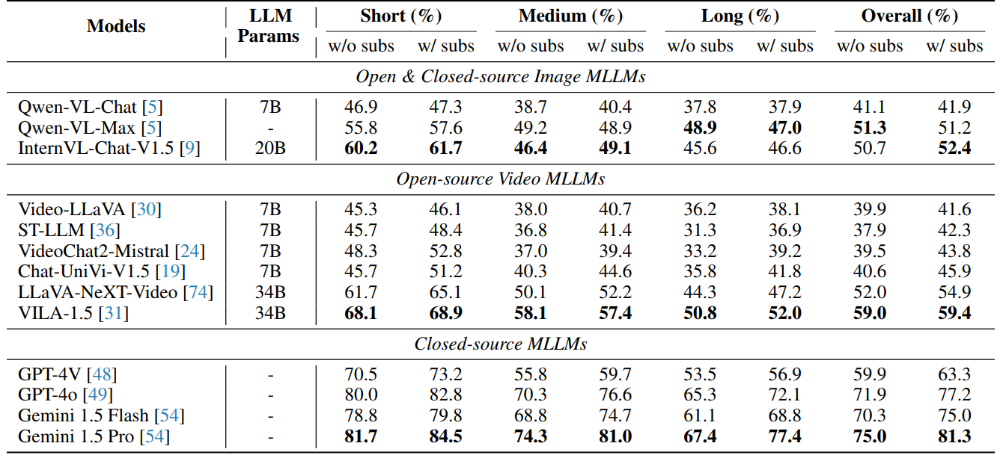
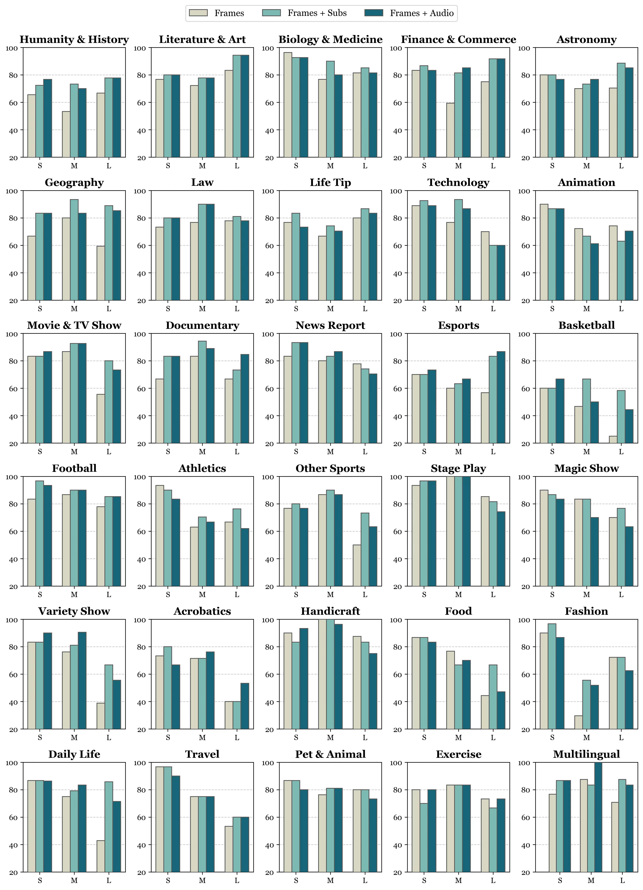

<p align="center">
    
    
</p>

<font size=7><div align='center' > [[🍎 Project Page]()] [[📖 arXiv Paper]()] [[📊 Dataset]()][[🏆 Leaderboard]()]  </div></font>

# The Curse of Multi-Modalities: Evaluating Hallucinations of Large Multimodal Models across Language, Visual, and Audio

 
 
 
  

**CMM** is the first to investigate hallucinations across *Language*, *Visual*, and *Audio* systematically. It benchmarks various LMMs across visual, audio, and their joint context.

---

## 🔥 News
* **`2024.10.04`** 🌟 We are very excited to launch **CMM**, the first-ever comprehensive hallucination evaluation benchmark of LMMs across language, visual, and audio!


## 👀 CMM Overview

Recent advancements in large multimodal models (LMMs) have significantly enhanced performance across diverse tasks, with ongoing efforts to further integrate additional modalities such as video and audio. However, most existing LMMs remain vulnerable to hallucinations, the discrepancy between the factual multi-modal input and the generated textual output, which has limited their applicability in various real-world scenarios. This paper presents the first systematic investigation of hallucinations in LMMs involving the three most common modalities: language, visual, and audio. 
Our work distinguishes from existing benchmarks through four key features: 
* *Essential Multi-Modalities*: We analyze hallucinations and evaluate LMMs across the three fundamental modalities: Language, Visual, and Audio. 
* *Systematic Hallucination Investigation*: Our study reveals two key contributors to hallucinations: overreliance on unimodal priors and spurious inter-modality correlations.
* *Comprehensive Diagnosis*: CMM defines hallucinations with nuanced subcategories and granularities, enabling comprehensive diagnosis of LMM vulnerabilities across various modalities.
* *Quality in Annotations*: **All data are newly annotated by humans, not from any existing video dataset**, ensuring diversity and quality. 

<p align="center">
    
</p>


<p align="center">
    
</p>

## 📐 Dataset Examples

<p align="center">
    
</p>

<div align='center' >
<details>
<summary> Click to expand more examples</summary>
<p align="center">
    
    
    
</details>
</div>


## 🔍 Dataset

**License**:
```
Video-MME is only used for academic research. Commercial use in any form is prohibited.
The copyright of all videos belongs to the video owners.
If there is any infringement in Video-MME, please email videomme2024@gmail.com and we will remove it immediately.
Without prior approval, you cannot distribute, publish, copy, disseminate, or modify Video-MME in whole or in part. 
You must strictly comply with the above restrictions.
```

Please send an email to **videomme2024@gmail.com**. 🌟


## 🔮 Evaluation Pipeline
📍 **Extract Frames and Subtitles**:

There are a total of **900 videos** and **744 subtitles**, where all long videos have subtitles.

With respect to the setting of adding subtitles, you should only use the subtitles corresponding to the sampled video frames.
For example, if you extract 10 frames per video for evaluation, take the 10 subtitles that corresponding to the time of those 10 frames.

If you have already prepared the video and subtitle file, you could refer to [this script](https://github.com/look4u-ok/video-slicer) to extract the frames and corresponding subtitles.


📍 **Prompt**:

The common prompt used in our evaluation follows this format:

```
This video's subtitles are listed below:
[Subtitles] 
Select the best answer to the following multiple-choice question based on the video. Respond with only the letter (A, B, C, or D) of the correct option. 
[Question]
The best answer is:
```

For the subtitles-free setting, you should remove the subtitle content.


<details>
<summary> Click to expand the prompt examples.</summary>

* With subtitles:

```
This video's subtitles are listed below:
Hi guys, I'm going to show you how to perfectly prepare a ...
Select the best answer to the following multiple-choice question based on the video. Respond with only the letter (A, B, C, or D) of the correct option.
What is the color of the clothing worn by the persons in the video?
A. Black.
B. Gray.
C. Green.
D. Brown.
The best answer is:
```

* Without subtitles:
```
Select the best answer to the following multiple-choice question based on the video. Respond with only the letter (A, B, C, or D) of the correct option.
What is the color of the clothing worn by the persons in the video?
A. Black.
B. Gray.
C. Green.
D. Brown.
The best answer is:
```
</details>


📍 **Evaluation**: 

To extract the answer and calculate the scores, we add the model response to a JSON file. Here we provide an example template [output_test_template.json](./evaluation/output_test_template.json). Once you have prepared the model responses in this format, please refer to the evaluation script [eval_your_results.py](https://github.com/thanku-all/parse_answer/blob/main/eval_your_results.py), and you will get the accuracy scores across video_durations, video domains, video subcategories, and task types. 
The evaluation does not introduce any third-party models, such as ChatGPT.

```bash
python eval_your_results.py \
    --results_file $YOUR_RESULTS_FILE \
    --video_duration_type $VIDEO_DURATION_TYPE \
    --return_categories_accuracy \
    --return_sub_categories_accuracy \
    --return_task_types_accuracy
```
Please ensure that the `results_file` follows the specified JSON format stated above, and `video_duration_type` is specified as either `short`, `medium`, or `long`. If you wish to assess results across various duration types, you can specify multiple types separated by commas or organize them in a list, for example: `short,medium,long` or `["short","medium","long"]`.

📍 **Leaderboard**: 

If you want to add your model to our [leaderboard](https://video-mme.github.io/home_page.html#leaderboard), please send model responses to **bradyfu24@gmail.com**, as the format of [output_test_template.json](./evaluation/output_test_template.json).


## 📈 Experimental Results
- **Evaluation results of different MLLMs.**

<p align="center">
    
</p>


- **Evaluation results of different MLLMs across different task types.**

<p align="center">
    
</p>

- **Evaluation results of Gemini 1.5 Pro across different video duration types.**

<p align="center">
    
</p>

- **Evaluation results of Gemini 1.5 Pro across different video sub-types.**

<p align="center">
    
</p>


## :black_nib: Citation

If you find our work helpful for your research, please consider citing our work.   

```bibtex
@article{fu2024video,
  title={Video-MME: The First-Ever Comprehensive Evaluation Benchmark of Multi-modal LLMs in Video Analysis},
  author={Fu, Chaoyou and Dai, Yuhan and Luo, Yondong and Li, Lei and Ren, Shuhuai and Zhang, Renrui and Wang, Zihan and Zhou, Chenyu and Shen, Yunhang and Zhang, Mengdan and others},
  journal={arXiv preprint arXiv:2405.21075},
  year={2024}
}
```

## 📜 Related Works

Explore our related researches:
-  **[MME]** [MME: A Comprehensive Evaluation Benchmark for Multimodal Large Language Models](https://github.com/BradyFU/Awesome-Multimodal-Large-Language-Models/tree/Evaluation)
-  **[Awesome-MLLM]** [A Survey on Multimodal Large Language Models](https://github.com/BradyFU/Awesome-Multimodal-Large-Language-Models)

