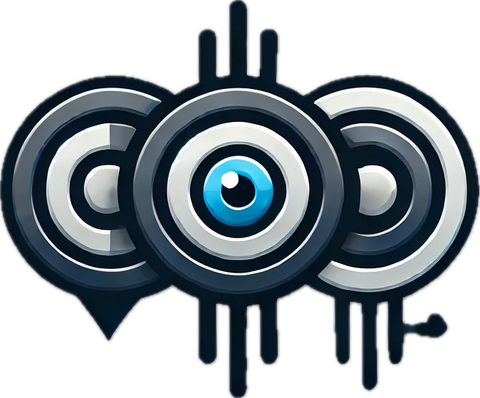

<p align="center">
    
    
</p>

<font size=7><div align='center' > [[🍎 Project Page]()] [[📖 arXiv Paper]()] [[📊 Dataset]()][[🏆 Leaderboard]()]  </div></font>

# The Curse of Multi-Modalities: Evaluating Hallucinations of Large Multimodal Models across Language, Visual, and Audio

 
 
 
  

**CMM** is the first to investigate hallucinations across *Language*, *Visual*, and *Audio* systematically. It benchmarks various LMMs across visual, audio, and their joint context.

---

## 🔥 News
* **`2024.10.04`** 🌟 We are very excited to launch **CMM**, the first-ever comprehensive hallucination evaluation benchmark of LMMs across language, visual, and audio!

<details open><summary>💡 Some other multimodal-LLM projects from our team may interest you ✨. </summary><p>
<!--  may -->

> [**Video-LLaMA: An Instruction-tuned Audio-Visual Language Model for Video Understanding**](https://github.com/DAMO-NLP-SG/Video-LLaMA) <br>
> Hang Zhang, Xin Li, Lidong Bing <br>
[](https://github.com/DAMO-NLP-SG/Video-LLaMA)  [](https://github.com/DAMO-NLP-SG/Video-LLaMA) [](https://arxiv.org/abs/2306.02858) <be>

> [**VideoLLaMA 2: Advancing Spatial-Temporal Modeling and Audio Understanding in Video-LLMs**](https://github.com/DAMO-NLP-SG/VideoLLaMA2) <br>
> Zesen Cheng, Sicong Leng, Hang Zhang, Yifei Xin, Xin Li, Guanzheng Chen, Yongxin Zhu, Wenqi Zhang, Ziyang Luo, Deli Zhao, Lidong Bing <br>
[](https://github.com/DAMO-NLP-SG/VideoLLaMA2)  [](https://github.com/DAMO-NLP-SG/VideoLLaMA2) [](https://arxiv.org/abs/2406.07476) <br>

> [**VCD: Mitigating Object Hallucinations in Large Vision-Language Models through Visual Contrastive Decoding**](https://arxiv.org/abs/2311.16922) <br>
> Sicong Leng, Hang Zhang, Guanzheng Chen, Xin Li, Shijian Lu, Chunyan Miao, Lidong Bing <br>
[](https://github.com/DAMO-NLP-SG/VCD)  [](https://github.com/DAMO-NLP-SG/VCD)  [](https://arxiv.org/abs/2311.16922) <br>

</p></details>

## 👀 CMM Overview

Recent advancements in large multimodal models (LMMs) have significantly enhanced performance across diverse tasks, with ongoing efforts to further integrate additional modalities such as video and audio. However, most existing LMMs remain vulnerable to hallucinations, the discrepancy between the factual multi-modal input and the generated textual output, which has limited their applicability in various real-world scenarios. This paper presents the first systematic investigation of hallucinations in LMMs involving the three most common modalities: language, visual, and audio. 
Our work distinguishes from existing benchmarks through four key features: 
* *Essential Multi-Modalities*: We analyze hallucinations and evaluate LMMs across the three fundamental modalities: Language, Visual, and Audio. 
* *Systematic Hallucination Investigation*: Our study reveals two key contributors to hallucinations: overreliance on unimodal priors and spurious inter-modality correlations.
* *Comprehensive Diagnosis*: CMM defines hallucinations with nuanced subcategories and granularities, enabling comprehensive diagnosis of LMM vulnerabilities across various modalities.
* *Quality in Annotations*: **All data are newly annotated by humans, not from any existing video dataset**, ensuring diversity and quality. 

<p align="center">
    
</p>

<p align="center">
    
    
</p>

## 🎓 Hallucination Investigations

<p align="center">
    
</p>

**Overreliance on unimodal priors** is a key factor contributing to hallucinations in LMMs. 
This issue arises when the model over-relies on the knowledge learned from one modality during training, rather than integrating knowledge of all available modalities.
In such cases, the model defaults to strong unimodal priors learned during training, leading to outputs that follow familiar unimodal patterns even when those patterns are not supported by the multimodal input.
Following the general issue of overreliance on unimodal priors, we categorize this into three distinct types: **Language Dominance**, **Visual Dominance**, and **Audio Dominance**. Each form of dominance presents unique challenges for LMM performance and contributes to hallucinations in different ways.

<p align="center">
    
</p>

Reducing information from the dominant modality forces the model to integrate cues from other modalities more effectively, thereby decreasing the likelihood of hallucinations. This validates the challenges posed by uni-modality overreliance in multimodal integration.

**Spurious inter-modality correlations** are a major contributor to hallucinations in LMMs, especially when integrating multiple modalities. Learned during pretraining on large-scale multimodal datasets (e.g., image-caption, video-caption, and audio-caption data), these correlations involve misleading associations between modalities that appear statistically significant but lack meaningful or causal connections.
Two common sources of spurious correlations are:
* Global occurrence frequency: The high overall occurrence of specific objects or events in the dataset leads LMMs to hallucinate these elements even when they are absent in the input.
* Co-occurrence frequency: Frequent co-occurrence of objects or events during training causes the model to incorrectly predict the presence of one of them when only the other is present.
We categorize them into three subtypes: **Visual-Language**, **Audio-Language**, **Visual-Audio-Language**.

<p align="center">
    
</p>

A consistent trend emerges: hallucinatory responses are associated with higher CoScores, indicating that higher co-occurrence frequencies increase the likelihood of hallucinations. This confirms the impact of spurious inter-modality correlations learned during pretraining.

## 📐 Dataset Composition and Evaluation Setup

For each subcategory, we manually collect 200 samples (video-only, audio-only, or video-audio pairs) to evaluate LMMs' handling of multimodal inputs. Each sample includes two modality-specific probing questions: one targeting a non-existent object or event (ground-truth answer ''no'') and one targeting an existent object or event (ground-truth answer ''yes''):
```
''Did you see [object/event] in the video?'', for visual queries
''Did you hear [event] in the audio?'', for audio queries
```

This results in a total of **1,200 samples and 2,400 probing questions**.
We benchmark LMMs using two core metrics, namely, Perception Accuracy (PA) and Hallucination Resistance (HR):

<p align="center">
    
</p>

PA measures the model's ability to accurately perceive present objects or events, while HR assesses its resistance to hallucinations by correctly identifying the absence of non-existent objects or events. Higher scores in both metrics indicate better perception and robustness against hallucinations.


## 🔮 Evaluation Pipeline
📍 **Prompt**:

The common prompt used in our evaluation follows this format:

```
''Did you see/hear [object/event] in the video/audio? Answer with yes or no.''
```

📍 **Evaluation**: 

To extract the answer and calculate the scores, we add the model response to a JSON file. Here we provide an example template [final_output.json](./evaluation/final_output.json). Once you have prepared the model responses in this format, please refer to the evaluation script [calculate_scores.py](./evaluation/calculate_scores.py), and you will get the PA and HR scores. 

```bash
python ./evaluation/calculate_scores.py
```
Please ensure that the `results_file` follows the specified JSON format stated above.

📍 **Leaderboard**: 

If you want to add your model to our [leaderboard](), please send model responses to **Lengsicong@gmail.com**, as the format of [final_output.json](./evaluation/final_output.json).


## 📈 Experimental Results
- **Evaluation results of different LMMs across language, visual, and audio.**

<p align="center">
    
</p>


- **Visual-only benchmark subset results grouped by probing granularity.**

<p align="center">
    
</p>

- **Effects of probing granularities and LLM decoder sizes.**

<p align="center">
    
</p>


## 🔍 License
```
CMM is only used for academic research. Commercial use in any form is prohibited.
The copyright of all videos belongs to the video owners.
If there is any infringement in CMM, please email Lengsicong@gmail.com and we will remove it immediately.
Without prior approval, you cannot distribute, publish, copy, disseminate, or modify CMM in whole or in part. 
You must strictly comply with the above restrictions.
```

## :black_nib: Citation

If you find our work helpful for your research, please consider star the repo and citing our work.   

```bibtex
@article{,
  title={},
  author={},
  journal={},
  year={2024}
}
```

## 📜 Acknowledgements


